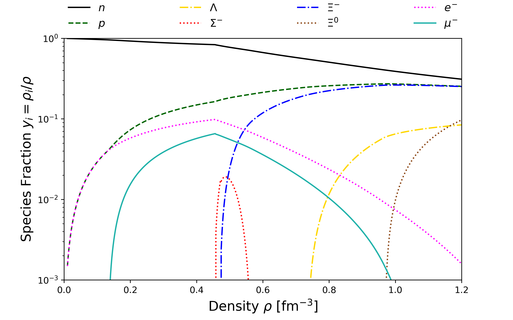

# Quark-Meson Coupling (QMC) model data and its visualisation

This repository contains the data for calculations which appeared in my PhD
thesis and several of my publications. These calculations are discussed at
length in my PhD thesis and the related published papers. The code has not been included because it makes use of the IMSL fortran library which is not open
source.

All that is contained within this repository is the output of the calculations
and new visualisations using python libraries. The data can be found in the **DATA/DLW/QMC** directory. The python notebooks are in the subdirectories of the **Data_visualisation** directory. It separates into the three directories BETA for Beta-equilibrium, SNM for Symmetric Nuclear Matter and PNM Pure Neutron Matter data files. The python notebooks will help you understand what
is actually in the data files. They produce several useful plots. The original plots in my thesis and papers were done in gnuplot, since
then I have learnt python and I think it does a much better job
creating aesthetically pleasing plots. There are also some data files which I
have obtained from other researchers which were used for various comparisons. Please see the references below for further information on these sources of published data.

There is also an Errata.pdf file which explains some corrections. Mostly
very minor typos in thesis tables and a small bug in the NJL mass
parametrisation for the cascade only, which affected their optical potentials.
This bug is only relevant to work that isn't in my thesis. It was published
separately in Physics Letters B762 (2016) 467–472.

I have also written a program called [PYTOV](https://github.com/dlwhittenbury/PYTOV), [PYTOV](https://github.com/dlwhittenbury/PYTOV) is a simple Python
implementation to integrate the Tolman-Oppenheimer-Volkoff (TOV) equations. It
is a fairly simple script. It has been placed on Github in a separate
repository. The output of this code for the equations of state contained in this repository are in the **Data/DLW/TOV** directory.

Here is an example of the the plots created in the notebooks

# References

Calculations appeared in the first 4 references:

1. [D. L. Whittenbury, PhD thesis](https://inspirehep.net/record/1495499/files/02whole.pdf) Hadrons and Quarks in Dense Matter: From Nuclear Matter to Neutron Stars, University of Adelaide.

2. D. L. Whittenbury, J. D. Carroll, A. W. Thomas, K. Tsushima, and J. R. Stone, Quark-meson coupling model, nuclear matter constraints, and neutron star properties. [Phys. Rev. C 89, 065801 (2014)](https://journals.aps.org/prc/abstract/10.1103/PhysRevC.89.065801)

3.  D. L. Whittenbury, H. H. Matevosyan, and A. W. Thomas, Hybrid stars using the quark-meson coupling and proper-time Nambu–Jona-Lasinio models. [Phys. Rev. C 93, 035807 (2016)](https://journals.aps.org/prc/abstract/10.1103/PhysRevC.93.035807)

4. [Phys. Lett. B762 467-472 (2016)](https://www.sciencedirect.com/science/article/pii/S0370269316305627?via%3Dihub) D. L. Whittenbury, M. E. Carrillo-Serrano, and A. W. Thomas, Quark–meson coupling model based upon the Nambu–Jona Lasinio model.

5. [Phys. Rev. C 86, 015803 (2012)](https://journals.aps.org/prc/abstract/10.1103/PhysRevC.86.015803) M. B. Tsang et al, Constraints on the symmetry energy and neutron skins from experiments and theory.

6. [Science 298, 1592 (2002)](https://science.sciencemag.org/content/298/5598/1592.figures-only), P. Danielewicz, R. Lacey, and W. G. Lynch, Determination of the Equation of State of Dense Matter.

7. [Phys. Rev. Lett. 110, 032504 (2013)](https://journals.aps.org/prl/abstract/10.1103/PhysRevLett.110.032504) I. Tews, T. Krüger, K. Hebeler, and A. Schwenk, Neutron Matter at Next-to-Next-to-Next-to-Leading Order in Chiral Effective Field Theory.

**See these references for a detailed list of references pertaining to theory, experiment and other data.**
